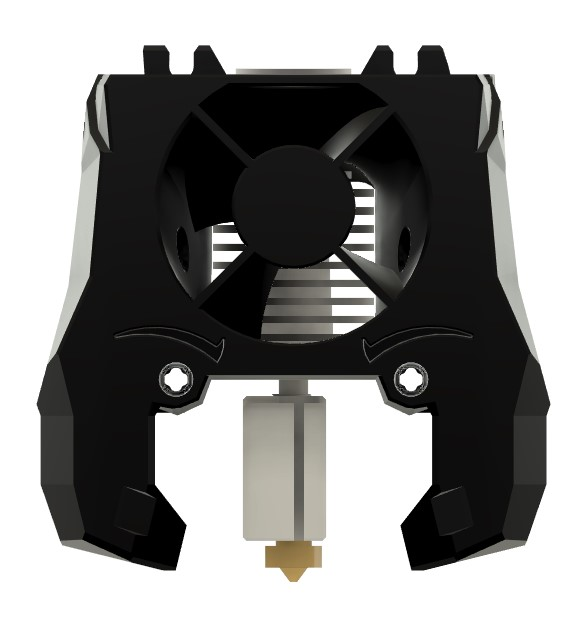
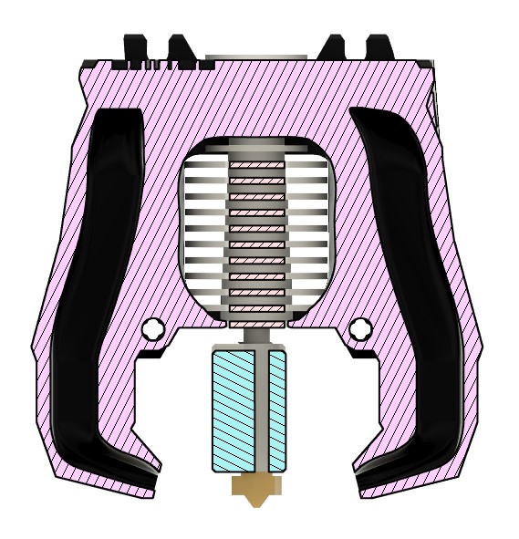
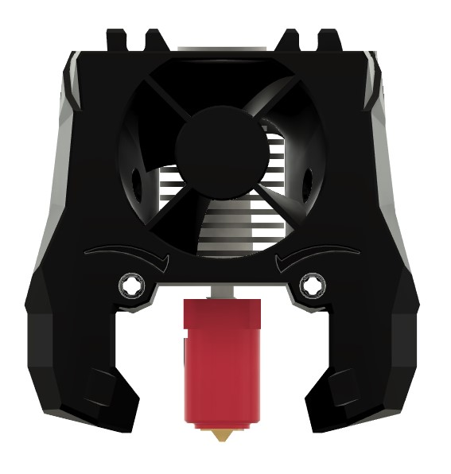

# Stealthburner E3DV6 Volcano

### Thanks to the amazing work from the Voron team!

---

I added a printhead for the Volcano variant of E3DV6. It is a simple extension of the part cooling ducts from the original Voron Stealthburner E3DV6 printhead.

Not the nicest looking mod unfortunately, my cad abilities are limited :/

(This should also work with the CHC Pro hotend.)

## Volcano

## CHC Pro
